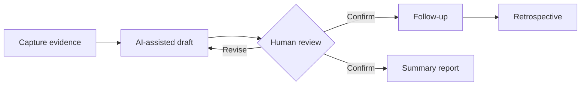

<h1 align="center">Organization Diagnosis Workbench</h1>

<p align="center"><strong>From scattered observations to reviewable assessments and accountable follow-through.</strong></p>

<p align="center">
  <a href="README.zh-CN.md">简体中文</a> ·
  <a href="CONTRIBUTING.md">Contributing</a> ·
  <a href="ROADMAP.md">Roadmap</a> ·
  <a href="SECURITY.md">Security</a>
</p>

<p align="center">
  
</p>

**Organization Signals (组织脉络)** is an open-source workspace for HR business partners, organizational development teams, and people leaders. It turns interviews, feedback, and team observations into traceable records, reviewable AI-assisted assessments, accountable follow-ups, and management-ready summaries.

AI helps structure evidence and draft suggestions. It does not make automated decisions about people, bypass human review, or turn an unconfirmed assessment into a downstream action.

> [!NOTE]
> This is an early-stage project under active development. The end-to-end workflow is usable today, while APIs and data structures may continue to evolve before the first stable release.

## Why this project exists

Important organizational signals often remain scattered across interview notes, meeting follow-ups, and personal documents. Context gets lost, similar issues are handled inconsistently, and AI-generated conclusions can be difficult to audit.

This project keeps four responsibilities deliberately separate:

1. **Capture evidence** — record what was observed without forcing an immediate conclusion.
2. **Assist analysis** — use AI or deterministic rules to organize signals into a structured draft.
3. **Confirm with a human** — review, revise, and explicitly approve the assessment.
4. **Follow through** — convert confirmed findings into owned actions, retrospectives, and reports.



## Product tour

### 1. Capture facts before drawing conclusions

Create, search, filter, and bulk-import work records so interviews and team observations remain traceable to their original context.

### 2. Use AI as a draft, then review it

Generate a structured assessment from the record, inspect its reasoning and risk level, and require a person to revise or confirm it before anything moves forward.

<p align="center">
  
</p>

### 3. Turn confirmed findings into follow-through

Bring confirmed medium- and high-risk items into one follow-up view, then track ownership, status, suggested actions, and retrospective results.

<p align="center">
  
</p>

### 4. Summarize what has actually been confirmed

Generate date-range reports from human-confirmed assessments and follow-up progress, then copy an individual report or batch-export UTF-8 CSV files.

<p align="center">
  
</p>

## What is included

- Work-record creation, editing, search, filtering, and transactional CSV import of up to 100 rows.
- Structured assessment drafts from DeepSeek, OpenAI, OpenRouter, or another OpenAI-compatible endpoint.
- Conservative built-in rules when an external provider is unavailable or returns invalid output.
- Explicit human review and confirmation before follow-ups or reports can use an assessment.
- Deduplicated follow-up items with status, actions, and retrospective notes.
- Date-range reports and Excel-friendly UTF-8 CSV batch export.
- ChatGPT identity and Cloudflare D1-backed per-user data isolation when deployed through ChatGPT Sites.

## Quick start

### Prerequisites

- Node.js 22.13 or newer
- pnpm 10

### Run locally

```bash
git clone https://github.com/wuhaowellha-creator/organization-diagnosis-tool.git
cd organization-diagnosis-tool
pnpm install
cp .env.example .env.local
pnpm db:generate
pnpm dev
```

Open `http://localhost:3000`. External AI credentials are optional; without them, the built-in assessment rules keep the core workflow available.

### Validate a change

```bash
pnpm check
```

This runs the automated tests, TypeScript validation, and a production build—the same checks used by GitHub Actions.

## AI providers and data handling

Provider settings are available from the **AI-assisted assessment** section on a work-record detail page.

| Provider | Environment variables |
| --- | --- |
| DeepSeek | `DEEPSEEK_API_KEY`, `DEEPSEEK_BASE_URL`, `DEEPSEEK_MODEL` |
| OpenAI | `OPENAI_API_KEY`, `OPENAI_BASE_URL`, `OPENAI_MODEL` |
| OpenRouter | `OPENROUTER_API_KEY`, `OPENROUTER_BASE_URL`, `OPENROUTER_MODEL` |
| Compatible API | `COMPATIBLE_API_KEY`, `COMPATIBLE_BASE_URL`, `COMPATIBLE_MODEL` |

Server-side keys never enter the business database. A user may optionally provide a browser-local key; it is sent to this application's server only when generating an assessment and is not persisted in D1. Read [SECURITY.md](SECURITY.md) before using real HR data or a shared device.

## Architecture

```text
React 19 + Vinext
        │
        ├── App routes and API handlers
        ├── Human-in-the-loop assessment domain
        ├── Multi-provider AI adapter + safety validation
        └── Drizzle ORM ── Cloudflare D1
```

The main AI path is:

```text
POST /api/records/:id/diagnose
  → resolve the current user's provider settings
  → call the provider adapter
  → validate structure and safety constraints
  → persist a pending assessment draft
  → require human confirmation
```

## API overview

- `GET|POST /api/records`
- `POST /api/records/import`
- `GET|PATCH /api/records/:id`
- `POST /api/records/:id/diagnose`
- `PATCH /api/diagnoses/:id`
- `POST /api/diagnoses/:id/confirm`
- `POST /api/records/:id/create-follow-up`
- `GET|PATCH /api/follow-ups/:id`
- `POST /api/reports/summary`
- `GET|PATCH /api/settings/ai`

Every business-data endpoint resolves the current user and scopes records to that user.

## Contributing

Bug reports, design discussions, documentation improvements, tests, and focused pull requests are welcome. Start with [CONTRIBUTING.md](CONTRIBUTING.md) and the [roadmap](ROADMAP.md).

The maintainer reviews issues and pull requests, owns architecture and releases, and keeps final merge and AI-assisted decisions under human control.

## License

MIT © 2026 [**YUY**](https://github.com/wuhaowellha-creator) [**(wuhaowellha-creator)**](https://github.com/wuhaowellha-creator). See [LICENSE](LICENSE).
