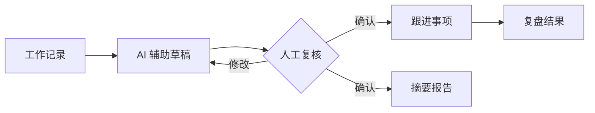

# 组织诊断工作台

**组织脉络**是一套面向 HRBP 的开源、人机协同组织诊断工作台。它把访谈和工作观察转化为可复核的诊断、可推进的跟进事项与可复用的管理报告，并确保 AI 结果不能绕过人工确认。

[English](README.md) · [贡献指南](CONTRIBUTING.md#中文) · [路线图](ROADMAP.md#中文) · [安全说明](SECURITY.md#中文)

> **项目状态：**早期、持续维护中。核心工作流已经可用，但外部用户与贡献者社区仍在建设；在数据可验证前，项目不会虚构 Star、下载量或使用规模。

## 为什么做这个项目

HR 观察经常散落在访谈笔记中，而 AI 直接生成的管理结论又缺少可追溯性。本项目提供一个可自行部署的参考实现，将事实输入、机器辅助、人工判断和后续执行清晰分离。

对开发者而言，它也展示了以下可复用能力：

- 与供应商解耦的 OpenAI 兼容模型适配层；
- 结构化输出校验与确定性降级规则；
- 下游动作前强制人工确认；
- 基于 Cloudflare D1 的用户数据隔离；
- 事务式 CSV 导入和可审计报告导出；
- 完整的 Vinext / React / ChatGPT Sites 应用实现。

## 核心流程



AI 输出始终只是草稿。未确认诊断不能创建跟进事项，也不会进入报告数据源。

## 主要能力

- 创建、编辑、搜索、筛选和批量导入工作记录。
- 单次导入最多 100 条 CSV；浏览器与服务端双重校验，任意一行不合格则整批拒绝。
- 使用 DeepSeek、OpenAI、OpenRouter 或其他兼容接口生成结构化诊断草稿。
- 外部模型不可用或输出不合规时，自动回退到审慎的内置规则。
- 诊断经人工编辑和确认后才可进入后续流程。
- 中高风险诊断可转为跟进事项，并防止重复创建。
- 管理跟进状态、建议动作与复盘结果。
- 按时间范围生成报告，并批量导出 Excel 可直接打开的 UTF-8 CSV。
- 部署到 ChatGPT Sites 后使用 ChatGPT 身份，并通过 D1 按用户隔离数据。

## 快速开始

要求：Node.js 22.13+、pnpm 10。

```bash
git clone https://github.com/wuhaowellha-creator/organization-diagnosis-tool.git
cd organization-diagnosis-tool
pnpm install
cp .env.example .env.local
pnpm db:generate
pnpm dev
```

访问 `http://localhost:3000`。外部 AI 密钥不是必需项；未配置时会使用内置诊断规则。

提交改动前运行：

```bash
pnpm check
```

该命令会执行自动化测试、TypeScript 检查和生产构建，与 GitHub Actions 保持一致。

## AI 接口与数据处理

AI 接口入口位于工作记录详情页的“AI 辅助诊断”区域。支持的服务端变量如下：

| 接口 | 环境变量 |
| --- | --- |
| DeepSeek | `DEEPSEEK_API_KEY`、`DEEPSEEK_BASE_URL`、`DEEPSEEK_MODEL` |
| OpenAI | `OPENAI_API_KEY`、`OPENAI_BASE_URL`、`OPENAI_MODEL` |
| OpenRouter | `OPENROUTER_API_KEY`、`OPENROUTER_BASE_URL`、`OPENROUTER_MODEL` |
| 兼容接口 | `COMPATIBLE_API_KEY`、`COMPATIBLE_BASE_URL`、`COMPATIBLE_MODEL` |

服务端密钥不会写入业务数据库。用户也可以使用保存在当前浏览器中的密钥；该密钥只在生成诊断时发送到本站服务端，不写入 D1。在处理真实 HR 数据或使用共享设备前，请阅读[安全说明](SECURITY.md#中文)。

## 架构

```text
React 19 + Vinext
        │
        ├── 页面与 API 路由
        ├── 人工确认式诊断领域逻辑
        ├── 多模型适配层与安全校验
        └── Drizzle ORM ── Cloudflare D1
```

## 参与维护

欢迎提交真实的缺陷、使用反馈、文档改进、测试和聚焦明确的 Pull Request。请先阅读[贡献指南](CONTRIBUTING.md#中文)与[路线图](ROADMAP.md#中文)。

维护者负责架构、Issue 分类、PR 评审、发布与文档，并确保所有合并、发布及 AI 辅助判断最终由人完成。

## 许可证

MIT © 2026 [Bighao](https://github.com/wuhaowellha-creator)。详见 [LICENSE](LICENSE)。
