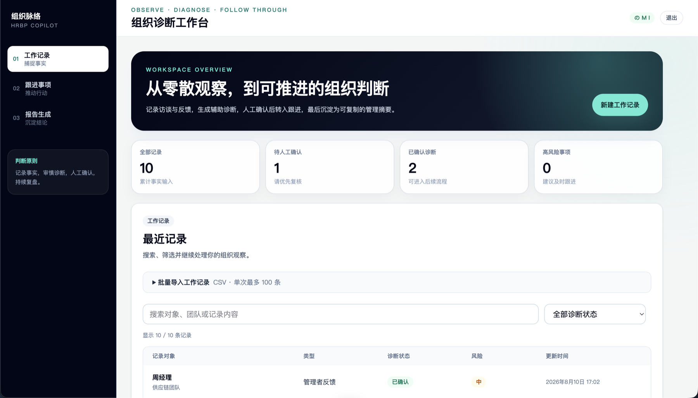
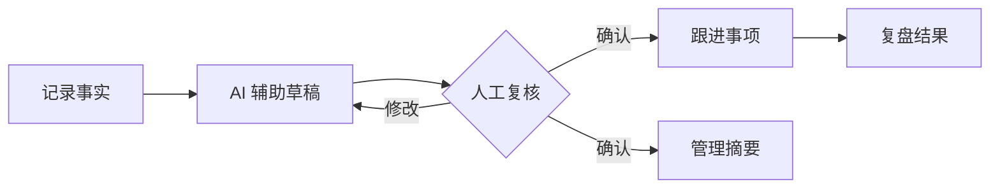
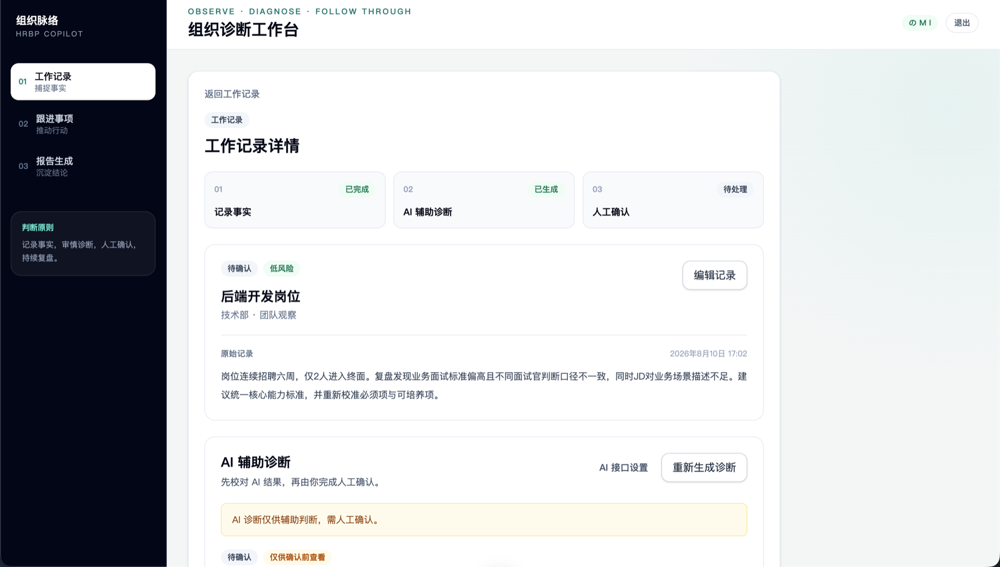
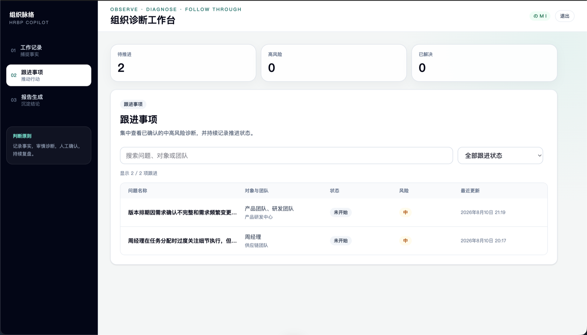
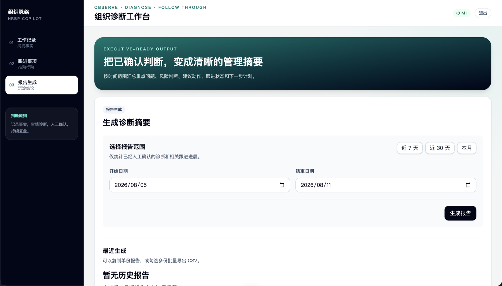

<h1 align="center">组织脉络</h1>

<p align="center"><strong>把零散的组织观察，转化为可复核的研判与可持续的行动。</strong></p>

<p align="center">
  <a href="README.md">English</a> ·
  <a href="CONTRIBUTING.md#中文">贡献指南</a> ·
  <a href="ROADMAP.md#中文">路线图</a> ·
  <a href="SECURITY.md#中文">安全说明</a>
</p>

<p align="center">
  
</p>

**组织脉络**是一套面向 HRBP、组织发展团队与承担组织管理职责的团队负责人的开源工作台。它把访谈、反馈和团队观察沉淀为可追溯的工作记录，在人工复核的前提下生成 AI 辅助研判，并将确认后的问题继续转为跟进事项和管理摘要。

AI 在这里负责整理线索、生成草稿和辅助表达；对人的评价、风险确认与后续动作始终由人决定。未经人工确认的研判不会进入跟进事项或报告。

> [!NOTE]
> 项目处于早期、持续开发阶段。当前端到端工作流已经可用，但在首个稳定版本发布前，API 与数据结构仍可能调整。

## 为什么做这个项目

重要的组织信号往往散落在访谈笔记、会议纪要和个人文档中：原始语境容易丢失，同类问题难以持续追踪，直接由 AI 生成的管理结论也不便审计。

组织脉络把四类职责清晰分开：

1. **记录事实**——HRBP 记录事实，保存观察到的内容。
2. **辅助研判**——由 AI 整理线索，形成结构化草稿。
3. **人工确认**——由使用者复核、修改并明确确认研判结果。
4. **持续跟进**——把已确认问题转为行动、复盘与管理摘要。



## 产品导览

### 1. 先记录事实，再形成判断

创建、搜索、筛选或批量导入工作记录，让访谈与团队观察保留原始语境，并能持续检索和补充。

### 2. 让 AI 提供草稿，由人确认结果

从原始记录生成结构化研判，查看依据与风险等级，并在进入后续流程前由使用者修改或确认。

<p align="center">
  
</p>

### 3. 把已确认问题转为跟进行动

集中查看已确认的中高风险事项，持续记录负责人、状态、建议动作与复盘结果，避免判断停留在报告里。

<p align="center">
  
</p>

### 4. 只汇总经过确认的信息

按时间范围汇总人工确认的研判与跟进进展，可复制单份摘要，也可批量导出 UTF-8 CSV。

<p align="center">
  
</p>

## 已包含的能力

- 创建、编辑、搜索、筛选工作记录，并支持单次最多 100 条的事务式 CSV 导入。
- 使用 DeepSeek、OpenAI、OpenRouter 或其他 OpenAI 兼容接口生成结构化研判草稿。
- 外部模型不可用或输出不合规时，回退到审慎的内置规则。
- 研判经人工编辑和确认后，才可进入跟进与报告流程。
- 将中高风险研判转为防重复的跟进事项，并记录状态、行动和复盘结果。
- 按时间范围生成管理摘要，并批量导出 Excel 可直接打开的 UTF-8 CSV。
- 部署到 ChatGPT Sites 后使用 ChatGPT 身份，并通过 Cloudflare D1 按用户隔离数据。

## 快速开始

环境要求：Node.js 22.13+、pnpm 10。

```bash
git clone https://github.com/wuhaowellha-creator/organization-diagnosis-tool.git
cd organization-diagnosis-tool
pnpm install
cp .env.example .env.local
pnpm db:generate
pnpm dev
```

访问 `http://localhost:3000`。外部 AI 密钥不是必需项；未配置时会使用内置研判规则，核心流程仍然可用。

提交改动前运行：

```bash
pnpm check
```

该命令会执行自动化测试、TypeScript 检查和生产构建，与 GitHub Actions 保持一致。

## AI 接口与数据处理

AI 接口设置位于工作记录详情页的“AI 辅助诊断”区域。

| 接口 | 环境变量 |
| --- | --- |
| DeepSeek | `DEEPSEEK_API_KEY`、`DEEPSEEK_BASE_URL`、`DEEPSEEK_MODEL` |
| OpenAI | `OPENAI_API_KEY`、`OPENAI_BASE_URL`、`OPENAI_MODEL` |
| OpenRouter | `OPENROUTER_API_KEY`、`OPENROUTER_BASE_URL`、`OPENROUTER_MODEL` |
| 兼容接口 | `COMPATIBLE_API_KEY`、`COMPATIBLE_BASE_URL`、`COMPATIBLE_MODEL` |

服务端密钥不会写入业务数据库。用户也可以使用保存在当前浏览器中的密钥；该密钥只在生成研判时发送到本站服务端，不写入 D1。在处理真实 HR 数据或使用共享设备前，请阅读[安全说明](SECURITY.md#中文)。

## 架构

```text
React 19 + Vinext
        │
        ├── 页面与 API 路由
        ├── 人工确认式研判领域逻辑
        ├── 多模型适配层与安全校验
        └── Drizzle ORM ── Cloudflare D1
```

核心 AI 路径：

```text
POST /api/records/:id/diagnose
  → 解析当前用户的模型设置
  → 调用模型适配层
  → 校验结构与安全约束
  → 保存待确认的研判草稿
  → 等待人工确认
```

## API 概览

- `GET|POST /api/records`
- `POST /api/records/import`
- `GET|PATCH /api/records/:id`
- `POST /api/records/:id/diagnose`
- `PATCH /api/diagnoses/:id`
- `POST /api/diagnoses/:id/confirm`
- `POST /api/records/:id/create-follow-up`
- `GET|PATCH /api/follow-ups/:id`
- `POST /api/reports/summary`
- `GET|PATCH /api/settings/ai`

所有业务数据接口都会识别当前用户，并把数据范围限制在该用户之内。

## 参与维护

欢迎提交真实缺陷、使用反馈、文档改进、测试和范围明确的 Pull Request。请先阅读[贡献指南](CONTRIBUTING.md#中文)与[路线图](ROADMAP.md#中文)。

维护者负责架构、Issue 分类、PR 评审、发布与文档，并确保合并、发布和 AI 辅助研判最终都由人决定。

## 许可证

MIT © 2026 [**YUY**](https://github.com/wuhaowellha-creator) [**(wuhaowellha-creator)**](https://github.com/wuhaowellha-creator)。详见 [LICENSE](LICENSE)。
